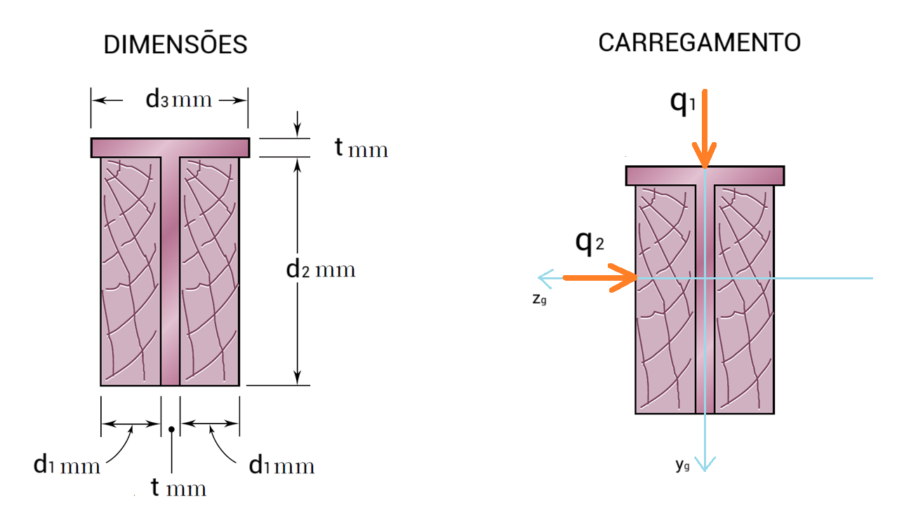
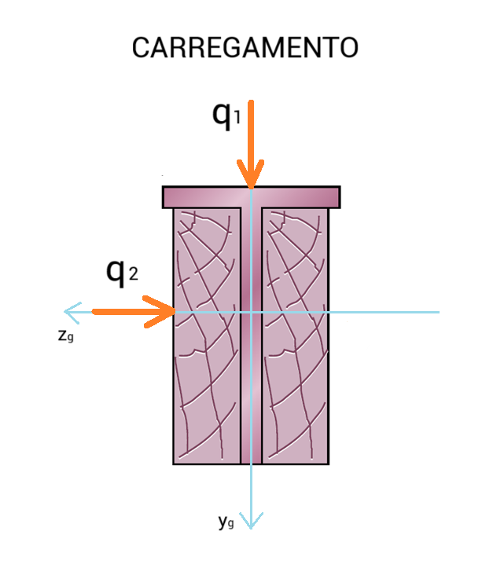

Duas placas de aço foram soldadas para formar uma viga em forma de **T** que foi reforçada aparafusando-se firmemente a ela duas pranchas de madeira, conforme mostra a figura. O módulo de elasticidade da madeira é de **Emad** GPa e do aço é de **Eaço** GPa. Sabendo que a viga tem **L** m de vão, se encontra simplesmente apoiada em suas extremidades, está solicitada por uma força uniformemente distribuída de **q1** kN/m na direção do eixo baricental (yg) e outra força uniformemente distribuída de q2 kN/m na direção do eixo baricentral (zg), como ilustrado na figura, determine: 

(a) A resultante das forças nos apoios. (**1 Ponto**)

(b) O momento máximo resultante em (kN.m) e a posição em (m) ao logo do vão em que ele acontece; (**1 Ponto**)

(c) A posição 𝑧̅ do baricentro da seção composta em (mm) tomando como referência o ponto inferior esquerdo da seção; (**1 Ponto**)

(d) A posição 𝑦̅ do baricentro da seção composta em (mm) tomando como referência o ponto inferior esquerdo da seção; (**1 Ponto**)

(e) O momento de inércia 𝐼zg em torno do eixo baricentral e principal de inércia (zg) da seção em (mm⁴); (**1 Ponto**)

(f) O momento de inércia 𝐼yg em torno do eixo baricentral e principal de inércia (yg) da seção em (mm⁴); (**1 Ponto**)

(g) A inclinação da linha neutra em (graus); (**1 Ponto**)

(h) As tensões máximas de tração e compressão no aço em (MPa); (**1 Ponto**)

(i) As tensões máximas de tração e compressão na madeira em (MPa); (**1 Ponto**)

(j) Considerando apenas a flexão normal em torno do eixo (zg), calcule o giro relativo entre as seções dos apoios; (**1 Ponto**)

